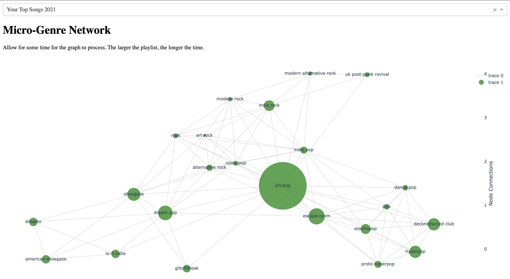

# Spotify Network

## Author

Will Stonehouse Salinas

## About

This is an interactive analytical web app that uses Dash as a framework. It connects to your Spotify account and allows you to select a playlist to analyze. What you see is a network of all the genres present in your playlist. As songs have multiple genres, they can act as connections between different genres. The more amount of instances of a genre in your playlist, the larger the node.

As you can see from the example below, interesting patterns emerges from some playlists. In the case of my playlist of my top 100 most played songs, 3 main branches formed. The clusetering is fascinating to look at to say the least!

## Purpose

The goal of this project is to create a new way for Spotify users to interact with their music data.
I was inspired by Spotify’s Wrapped because I love seeing what genres I’ve come to listen to more over the years.
I wanted to understand how the genres of my most listened to tracks are all connected as a network.
Users can also visualize the genre networks of any of their playlists. 

## Status

This app is still in development. Next steps are getting the app on Flask. For now you must run it on your machine.

## Usage

To run it on your machine, change the variable which contains your username. Before running the app, you must make an app on Spotify and export the following enviornment variables:

export SPOTIPY_CLIENT_ID='your_secret_ID'

export SPOTIPY_CLIENT_SECRET='your_secret_client'

export SPOTIPY_REDIRECT_URI='https://www.google.com/'

## Examples

 
