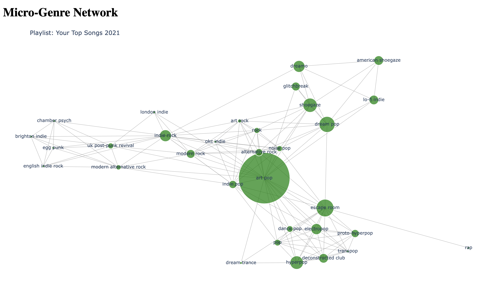

# Spotify Network

## Author

Will Stonehouse Salinas

## Purpose

The goal of this project is to create a new way for Spotify users to interact with their music data.
I was inspired by Spotify’s Wrapped because I love seeing what genres I’ve come to listen to more over the years.
I wanted to understand how the genres of my most listened to tracks are all connected as a network.
Users can also visualize the genre networks of any of their playlists. 

## Examples

 
